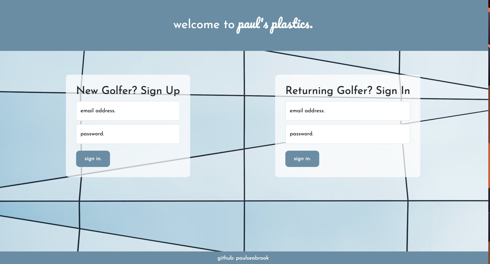
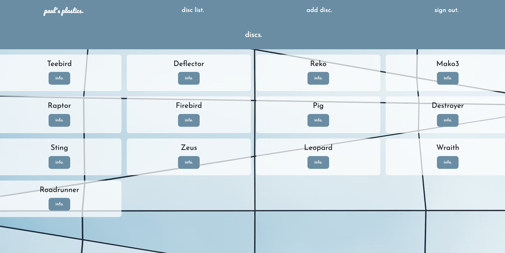
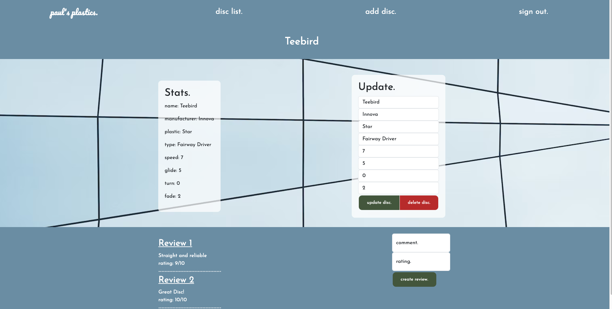
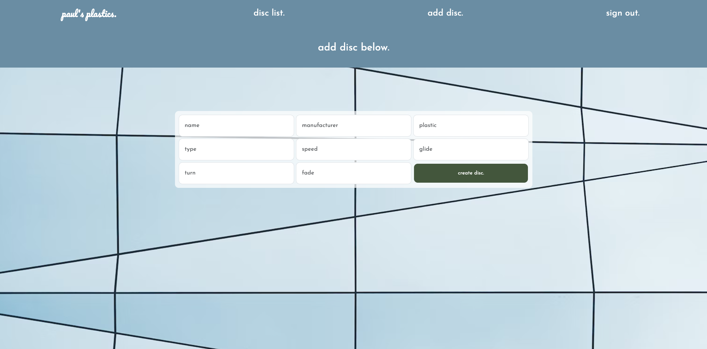

# paul's plastics

paul's plastics is an application that allows disc golfers to come together to add their favorite discs and check stats and information on others. They can leave comments and ratings based on their experience with a particular disc.

### Access the project [here](https://paulseabrook.github.io/pauls-plastics/)

---

## Screenshots

---

## Tehnologies Used

- Javascript
- CSS
- HTML
- Bootstrap
- Express
- Node
- MongoDB
- Mongoose
- Cors
- Bcrypt
- Passport
- Passport-JWT

---

## Getting Started

- You will first sign up with an email address and password.
- Once you are signed up, you will sign in with that same email address and password.
- You will be brought to a screen showing the list of discs.
- You can click "info." to see different stats on the disc.
- There will be a section to update the disc's information if necessary.
- You can also delete a disc if there is a duplicate elsewhere.
- At the bottom, you can leave a comment and rating to add for that specific disc.
- You can click "disc list." to be brought back to the list of discs.
- If you want to add a disc, simply click "add disc." on the nav bar at the top.
- Click "sign out." to be brought back to the sign in/ sign out screen.

---

## Next Steps

### Version 2

#### As a user, I want to:

- Have the ability to add links to sites where I can purchase the disc.
- Have the ability to add a picture of the disc.
- Be able to delete and update "reviews".
- See which user left the "review".
- See an "About" section.

---

### Version 3

#### As a user, I want to:

- Be able to add a description of the disc's flight pattern when the disc is created.
- Utilize search functionality to filter out the list of discs based on some criteria.
- Be able to click a "Facebook", "Twitter", or "Instagram" button and be taken to the respective site to make a "post" about the disc.
